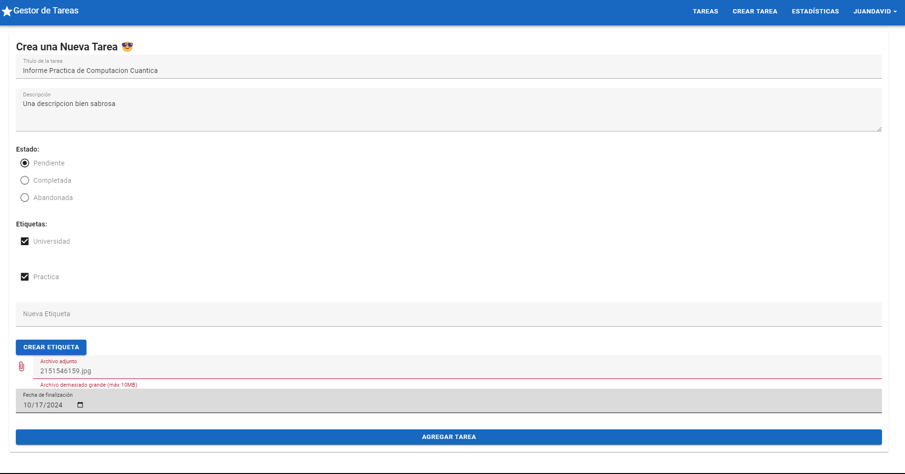

# **Task Manager Frontend**

¡Bienvenido a **Task Manager Frontend**! Esta es una aplicación web desarrollada con Vue.js y TypeScript que permite gestionar tareas de manera eficiente. La aplicación ofrece funcionalidades como creación, visualización, edición y eliminación de tareas, así como la posibilidad de agregar etiquetas y archivos adjuntos. Además, incluye funcionalidades de autenticación y estadísticas para mejorar la experiencia del usuario.

## **Tabla de Contenidos**

- [Características](#características)
- [Capturas de Pantalla](#capturas-de-pantalla)
  - [Visualizador de Tareas](#visualizador-de-tareas)
  - [Completar Tarea](#completar-tarea)
  - [Borrar Tarea](#borrar-tarea)
  - [Editar Tarea](#editar-tarea)
  - [Crear Tarea](#crear-tarea)
  - [Agregar Etiquetas](#agregar-etiquetas)
  - [Agregar Archivo](#agregar-archivo)
  - [Estadísticas](#estadísticas)
  - [Inicio de Sesión y Registro](#inicio-de-sesión-y-registro)
- [Requisitos Previos](#requisitos-previos)
- [Instalación](#instalación)
- [Uso](#uso)
- [Construido con](#construido-con)
- [Licencia](#licencia)
- [Autor](#autor)

## **Características**

- **Visualización de Tareas**: Lista de tareas con detalles como título, descripción, fecha límite y etiquetas.
- **Creación de Tareas**: Permite crear nuevas tareas con la opción de agregar etiquetas y archivos adjuntos.
- **Edición de Tareas**: Modificación de tareas existentes.
- **Eliminación de Tareas**: Posibilidad de borrar tareas que ya no son necesarias.
- **Completar Tareas**: Marcar tareas como completadas.
- **Etiquetas**: Añadir etiquetas a las tareas para una mejor organización.
- **Archivos Adjuntos**: Adjuntar archivos a las tareas (imágenes, documentos, etc.).
- **Estadísticas**: Visualización de estadísticas sobre las tareas.
- **Autenticación**: Sistema de registro e inicio de sesión para proteger el acceso a la aplicación.

## **Capturas de Pantalla**

A continuación, se muestran algunas capturas de pantalla de las principales funcionalidades de la aplicación:

### **Visualizador de Tareas**


_Descripción_: Muestra la lista de tareas con detalles importantes para el usuario.

### **Completar Tarea**


_Descripción_: Permite marcar una tarea como completada directamente desde la lista.

### **Borrar Tarea**


_Descripción_: Opción para eliminar tareas que ya no son necesarias.

### **Editar Tarea**


_Descripción_: Formulario para editar los detalles de una tarea existente.

### **Crear Tarea**


_Descripción_: Formulario para crear una nueva tarea con todas las opciones disponibles.

### **Agregar Etiquetas**



_Descripción_: Posibilidad de asignar etiquetas a las tareas para una mejor categorización.

### **Agregar Archivo**


_Descripción_: Permite adjuntar archivos a las tareas, como imágenes o documentos.

### **Estadísticas**


_Descripción_: Visualización de estadísticas sobre el progreso y estado de las tareas.

### **Inicio de Sesión y Registro**


_Descripción_: Pantalla de inicio de sesión para acceder a la aplicación.


_Descripción_: Formulario de registro para crear una nueva cuenta de usuario.

## **Requisitos Previos**

- **Node.js** (versión 14 o superior)
- **npm** (versión 6 o superior)
- **Docker** (opcional, si deseas ejecutar la aplicación en un contenedor)

## **Instalación**

1. **Clonar el repositorio**

   ```bash
   git clone https://github.com/tu-usuario/Task_Manager_Frontend.git
   ```

2. **Navegar al directorio del proyecto**

   ```bash
   cd Task_Manager_Frontend
   ```

3. **Instalar las dependencias**

   ```bash
   npm install
   ```

4. **Configurar las variables de entorno**

   Crea un archivo `.env` en la raíz del proyecto y agrega las siguientes variables:

   ```env
   VITE_API_URL=http://localhost:8000/api
   ```

   _Ajusta la URL de la API según sea necesario._

## **Uso**

### **Ejecutar en Desarrollo**

Para iniciar la aplicación en modo de desarrollo:

```bash
npm run dev
```

La aplicación estará disponible en `http://localhost:3000`.

### **Construir para Producción**

Para compilar la aplicación para producción:

```bash
npm run build
```

### **Ejecutar con Docker**

Si prefieres ejecutar la aplicación en un contenedor Docker:

1. **Construir la imagen Docker**

   ```bash
   docker build -t task_manager_frontend .
   ```

2. **Ejecutar el contenedor**

   ```bash
   docker run -d -p 8080:80 --name task_manager_frontend_container task_manager_frontend
   ```

La aplicación estará disponible en `http://localhost:8080`.

## **Construido con**

- [Vue.js](https://vuejs.org/) - El framework JavaScript utilizado.
- [TypeScript](https://www.typescriptlang.org/) - Lenguaje de programación utilizado.
- [Vuetify](https://vuetifyjs.com/) - Framework de componentes de Material Design para Vue.js.
- [Axios](https://axios-http.com/) - Cliente HTTP para realizar solicitudes a la API.
- [Docker](https://www.docker.com/) - Utilizado para contenerizar la aplicación.

## **Licencia**

Este proyecto está bajo la Licencia MIT - mira el archivo [LICENSE](LICENSE) para más detalles.

## **Autor**

- **Juan Cruz** - [Tu Perfil de GitHub](https://github.com/JuanHoKKeR/)

---
